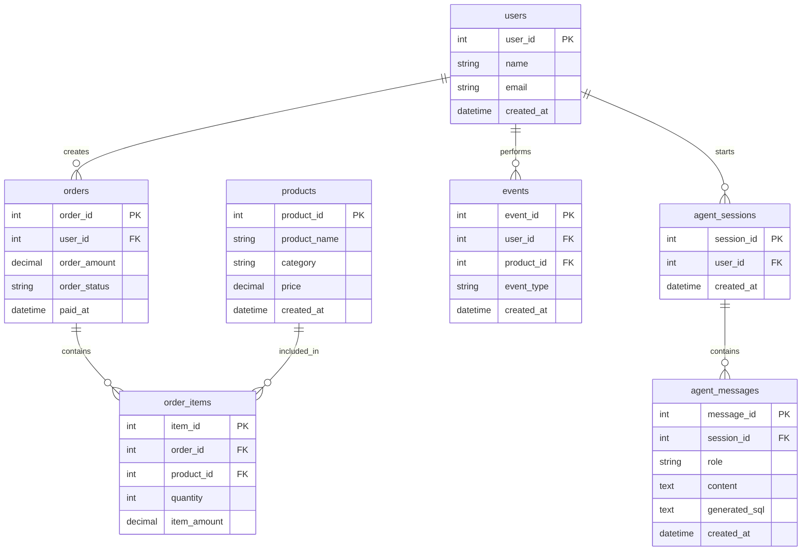

# Data Agent ER 图设计

## 1. ER 图说明

本项目主要围绕电商业务数据和 Data Agent 会话数据进行数据库设计。

核心实体包括：

- users：用户表
- products：商品表
- orders：订单表
- order_items：订单明细表
- events：用户行为表
- agent_sessions：Agent 会话表
- agent_messages：Agent 消息表

## 2. 实体关系

1. users 与 orders 是一对多关系，一个用户可以产生多个订单。
2. orders 与 order_items 是一对多关系，一个订单可以包含多个商品明细。
3. products 与 order_items 是一对多关系，一个商品可以出现在多个订单明细中。
4. users 与 events 是一对多关系，一个用户可以产生多条访问、浏览或点击行为。
5. users 与 agent_sessions 是一对多关系，一个用户可以创建多个 Agent 对话会话。
6. agent_sessions 与 agent_messages 是一对多关系，一个会话可以包含多条对话消息。

## 3. Mermaid ER 图

